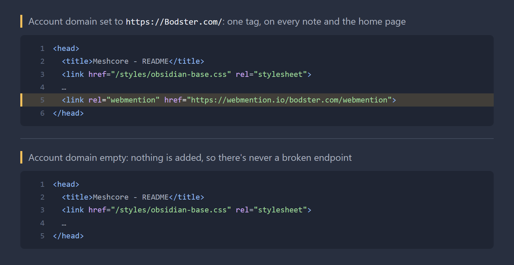

# Webmention Endpoint

A [Digital Garden](https://github.com/oleeskild/digitalgarden) plugin that lets your garden **receive** [webmentions](https://indieweb.org/Webmention). It adds a webmention.io endpoint to the `<head>` of every note and the home page:

```html
<link rel="webmention" href="https://webmention.io/example.com/webmention">
```

It's for gardens where you can't edit the site template, such as ones hosted on [Forestry.md](https://forestry.md), but it works on any garden.



## What it does and doesn't do

- **Does:** advertise where other sites should send webmentions for your pages.
- **Doesn't:** show mentions. For that, use [Webmentions](https://github.com/oleeskild/garden-plugin-webmentions), which is designed to be used alongside this plugin (see [below](#showing-mentions)).
- **Doesn't:** send webmentions, or handle pingbacks.

## Account domain vs garden domain

Two domains are involved, and they don't have to be the same:

- The **account domain** is the one you log in to webmention.io with. Your mentions are stored in that account.
- The **garden domain** is the site the tag appears on.

For example, a garden at `bodster.forestry.md` can advertise `https://webmention.io/bodster.com/webmention`. Mentions of forestry pages land in the `bodster.com` webmention.io account, with target URLs on `bodster.forestry.md`.

This is what makes it work for hosted gardens. Logging in to webmention.io uses [IndieAuth](https://indieauth.com), which needs control of the domain's home page. On a hosted garden you usually don't have that, so you log in with a domain you do control and point the garden at that account instead.

If your garden is on your own domain and you log in to webmention.io with it, the two domains are simply the same.

## Setting

| Setting | Default | |
|---|---|---|
| Webmention.io account domain | empty | Domain you log in to webmention.io with. Can differ from this garden's domain. |

You can paste a URL: `https://Example.com/` is tidied up to `example.com`. While the setting is empty (or isn't a valid domain), the plugin adds nothing, so a half-configured garden never advertises a broken endpoint.

It can also be set with the `WEBMENTION_ENDPOINT_DOMAIN` environment variable. A value saved in the plugin settings takes priority.

## Showing mentions

To show received mentions under your notes, also install [Webmentions](https://github.com/oleeskild/garden-plugin-webmentions) and set it up like this:

- **Domain:** your **garden** domain (e.g. `bodster.forestry.md`), because mentions are looked up by the page they point at.
- **API token:** the token from your **account** domain's webmention.io dashboard (e.g. the `bodster.com` account).

## Installing

Paste this repo's URL into **Install from GitHub** (in Obsidian: Settings → Digital Garden → Plugins), or copy this folder to `src/plugins/webmention-endpoint/` in your garden. Then set the account domain.

> [!WARNING]
> Don't install this on a garden whose template already has a `<link rel="webmention">` tag, including one added as a custom head component. You'd end up with two tags. Remove the existing one or skip this plugin.

To check it's working, view the source of any note and look for `rel="webmention"`, or run:

```sh
curl -s https://your-garden.example/ | grep webmention
```

## Licence

MIT. See [LICENSE](LICENSE).
